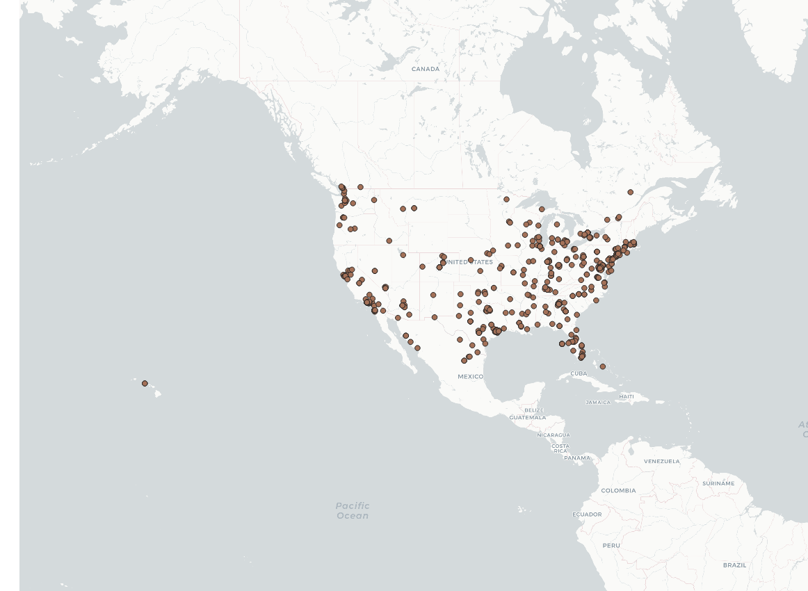

# GEOG458Lab2
## Devyn Duvall

The data that has been shown in this map is of Tweets about coronavirus in the united states. An apparent distribution is that majority of the tweets about the disease are coming from the coasts of the country (west and east coasts respectively). There also seems to be way more on the east coast than the west which could be because the majority of news outlets are based out of that region of the country.
