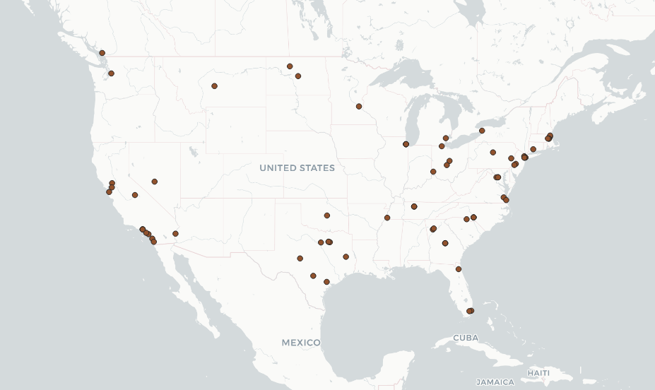

# GEOG458Lab2
## Devyn Duvall

The data that has been shown in this map is of Tweets about Robinhood. As some people may know, Robinhood is a free to trading platform on the stock market. Its taken twitter by storm in regards to what is going on with the Reddit forms and hedgefund corporations "loosing it all." The data that I was able to get had no direct correlation because of the time period that I chose. It does seem that there is more tweets around New York City and the east coast. Majority of the people that are associated with the stock market are associated around Wall Street which makes sense for the tweets. I think it would be interesting to increase the time limit to an hour or two to see where more people are discussing this phenomenon.
